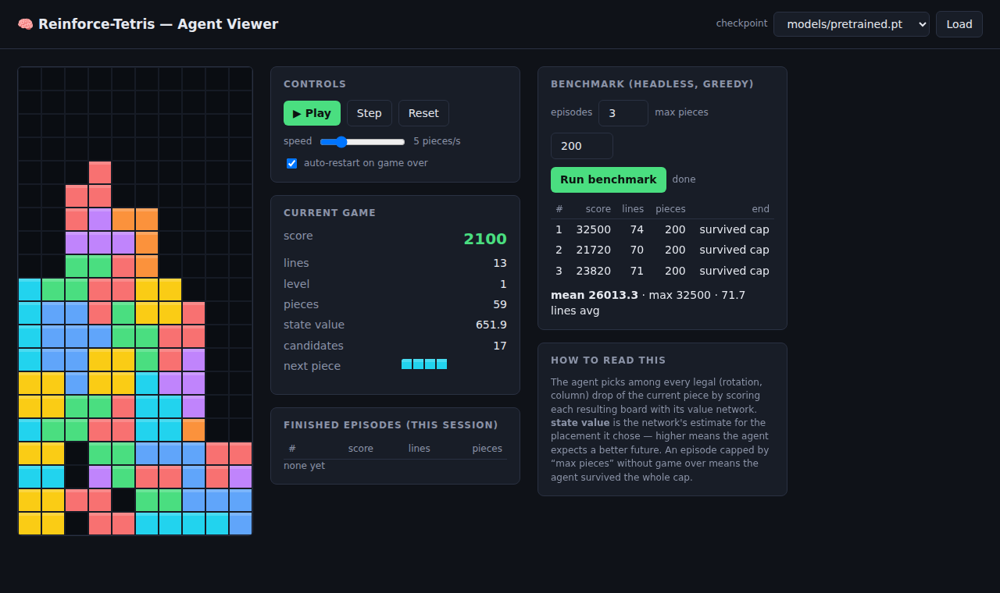
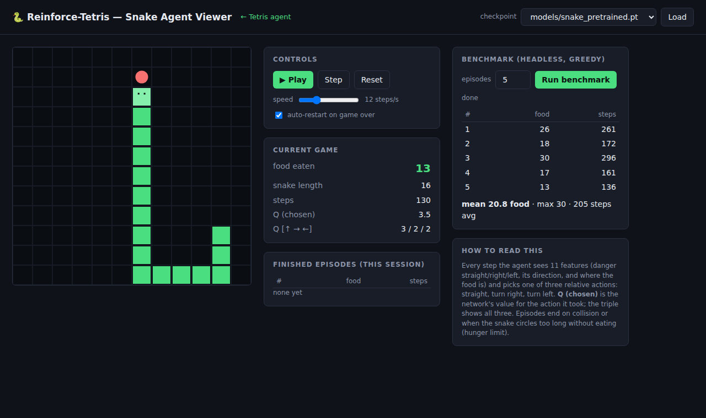

# Reinforce-Tetris

A standard Tetris game plus a reinforcement-learning pipeline that trains an
agent to score, using parallel environment workers. Also includes a Snake
game with its own DQN agent trained the same way (see [Snake](#snake)).

## Setup

```bash
pip install -r requirements.txt
# CPU-only torch: pip install torch --index-url https://download.pytorch.org/whl/cpu
```

## Play Tetris yourself

```bash
python play.py
```

Arrow keys move/rotate, `z`/`x` rotate, space hard-drops, `p` pauses, `q` quits.
Classic NES-style scoring (40/100/300/1200 × level+1, plus drop points).

## Train the agent

```bash
python train.py --workers 4 --total-pieces 200000
```

Progress is printed every 500 steps; per-episode results land in
`runs/latest/episodes.csv` and checkpoints in `runs/latest/{latest,best}.pt`.
Useful flags: `--gamma`, `--lr`, `--eps-decay-frac`, `--buffer-size`
(see `python train.py --help`).

## Web UI — watch & validate the model

```bash
python serve.py            # auto-loads the newest checkpoint (models/pretrained.pt ships with the repo)
# open http://localhost:8000
```



The browser viewer lets you validate model performance directly:

- **Live play** with drop animation, speed slider (1–20 pieces/s), play/pause/
  single-step/reset, and auto-restart.
- **Decision insight**: the network's value estimate for each chosen placement
  and the number of candidate placements it picked from.
- **Episode history** of every finished game in the session.
- **Benchmark button**: runs N greedy headless episodes server-side and reports
  per-episode score/lines plus mean/max — a quick quantitative check to go with
  the visual one.
- **Checkpoint dropdown** to hot-swap any `.pt` under `runs/` or `models/` and
  compare training stages.

A pretrained checkpoint (`models/pretrained.pt`, 18k pieces of training) is
included so the UI works immediately after cloning.

## Evaluate / watch the agent (terminal)

```bash
python evaluate.py --checkpoint runs/latest/best.pt --episodes 5
python evaluate.py --checkpoint runs/latest/best.pt --render   # watch it play
```

## How it works

**Game** (`tetris_rl/game.py`) — pure numpy Tetris: 10×20 board, 7-bag
randomizer, wall-kick rotation, line clears, NES scoring. It exposes both a
step-wise interface for human play and a placement interface
(`legal_placements` / `apply_placement`) for the agent.

**Environment** (`tetris_rl/env.py`) — an action is one of the legal
(rotation, column) hard-drop placements of the current piece. Each candidate
placement is summarized by 4 afterstate features:
`[lines_cleared, holes, bumpiness, total_height]`. Reward is
`1 + lines² × 10` per piece with a penalty on top-out, so multi-line clears
(especially Tetrises) are strongly rewarded. This placement-level formulation
is dramatically more sample-efficient than frame-level actions.

**Learning** (`train.py`) — a small MLP value network `V(afterstate)` is
trained with TD(0): `V(s'_t) → r_t + γ·V(s'_{t+1})`, with epsilon-greedy
exploration over candidate placements and a replay buffer.

**Parallelism** (`tetris_rl/vec_env.py`) — N worker processes each run their
own game and compute candidate features (numpy only). Every global step the
main process batches *all* candidates from *all* workers through one forward
pass, picks per-environment actions, and sends them back over pipes —
SubprocVecEnv-style synchronous parallel rollout with a single shared network.

## Snake

The same recipe applied to Snake, in `snake_rl/`:



```bash
python play_snake.py                                # play yourself (curses)
python train_snake.py --workers 4 --total-steps 400000   # train
python evaluate_snake.py --checkpoint runs/snake/best.pt  # headless eval
python serve.py                                     # web UI: open /snake
```

- **Game** (`snake_rl/game.py`): classic Snake on a 12×12 grid — eat food,
  grow, die on walls/yourself, reversing is ignored.
- **Environment** (`snake_rl/env.py`): the classic compact state — 11 features
  (danger straight/right/left, direction one-hot, food direction) and 3
  relative actions (straight / turn right / turn left). Reward +10 for food,
  −10 for dying or starving past a hunger limit (prevents infinite loops).
- **Learning** (`train_snake.py`): standard DQN — Q-network with a target
  network, epsilon-greedy exploration, replay buffer — using the same
  parallel-worker design as Tetris (`snake_rl/vec_env.py`): workers simulate,
  the main process batches all states through one forward pass per step.
- **Web UI**: `python serve.py` then open http://localhost:8000/snake for live
  play with Q-value readout, episode history, benchmark button and checkpoint
  hot-swap. A pretrained model (`models/snake_pretrained.pt`) ships with the
  repo; it averages ~18–21 food per game (max ~32, snake length 35 on a
  144-cell board).

## Tests

```bash
python -m pytest tests/ -q
```
